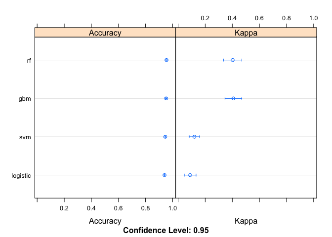

In this project, I'll be chasing down robots for an online auction site.
The goal is to identify online auction bids that are placed by "robots",
helping the site owners easily flag these users for removal from their
site to prevent unfair auction activity.

Libraries required
------------------

    library(dplyr)

    ## 
    ## Attaching package: 'dplyr'

    ## The following objects are masked from 'package:stats':
    ## 
    ##     filter, lag

    ## The following objects are masked from 'package:base':
    ## 
    ##     intersect, setdiff, setequal, union

    library(tidyr)
    library(knitr)
    library(devtools)
    library(easyGgplot2)

    ## Loading required package: ggplot2

Getting And Cleaning Data
-------------------------

### Downloading Data

    download.file("https://www.kaggle.com/c/facebook-recruiting-iv-human-or-bot/download/train.csv.zip","train.csv.zip")
    download.file("https://www.kaggle.com/c/facebook-recruiting-iv-human-or-bot/download/test.csv.zip","test.csv.zip")

    download.file("https://www.kaggle.com/c/facebook-recruiting-iv-human-or-bot/download/bids.csv.zip","bids.csv.zip")
    download.file("https://www.kaggle.com/c/facebook-recruiting-iv-human-or-bot/download/sampleSubmission.csv", "sampleSubmission.csv")

### Loading Data

    train <- read.csv("train.csv")
    test <- read.csv("test.csv")
    bids <- read.csv("bids.csv")
    sampleSubmission <- read.csv("sampleSubmission.csv")

### Understanding the Data

The data is primarily composed of two tables. One is a simple list of
all bidders and the second one contains all the bids made by these
bidders.

### Merge Data

I will be combining the two datasets on Bidder ID. At the beginning, I
need to remove all training and test samples that are not in the bid
data frame.

    train$bidder_id <- as.character(train$bidder_id)
    test$bidder_id <- as.character(test$bidder_id)
    bids$bidder_id <- as.character(bids$bidder_id)

    train$outcome <- as.factor(train$outcome)

    train <- train[train$bidder_id %in% bids$bidder_id, ]
    test <- test[test$bidder_id %in% bids$bidder_id, ]

I can verify if any of the data in the columns is missing

    colSums(is.na(bids))

    ##      bid_id   bidder_id     auction merchandise      device        time 
    ##           0           0           0           0           0           0 
    ##     country          ip         url 
    ##           0           0           0

    colSums(is.na(train))

    ##       bidder_id payment_account         address         outcome 
    ##               0               0               0               0

    colSums(is.na(test))

    ##       bidder_id payment_account         address 
    ##               0               0               0

Replace non available countries with NA

    bids[ bids$country == "", "country" ] <- NA

To do any kind of prediction and apply machine learning, I need to
summarize the data on Bidder ID level. This is because bidder and not
bids can be bots. Hence, target variable is defined on bidder level.

    bid_train <- merge(bids,train, by= "bidder_id")

Expolatory Data Analysis and Feature Selection
----------------------------------------------

Finding variables which are able to distinguish humans from robots is
the first thing I will do before building any kind of model. In order to
do so, what I simply do is find the mean value of each parameter for
both humans and Robots and see if they look different. There are many
other ways to do the same thing, however this is the simplest of them
all the understand.

### Order data frames by bidder id and time

    bid_train <- bid_train[order(bid_train$bidder_id, bid_train$time),]
    train <- train[order(train$bidder_id),]

### mean number of bidders

    mean_nb_bidders <- summarise(group_by(bid_train,outcome), nb_bidders = n_distinct(bidder_id)) %>%
        select(-outcome)

### mean number of bids per bidder

    mean_nb_bids <- summarise(group_by(summarise(group_by(bid_train,outcome,bidder_id),nb_bids = n_distinct(bid_id)),outcome), nb_bids = mean(nb_bids)) %>%
        select(-outcome)

### mean number of auctions per bidder

    mean_nb_auctions <- summarise(group_by(summarise(group_by(bid_train,outcome,bidder_id),nb_auctions = n_distinct(auction)),outcome), nb_auctions = mean(nb_auctions)) %>%
        select(-outcome)

### mean number of devices per bidder

    mean_nb_devices <- summarise(group_by(summarise(group_by(bid_train,outcome,bidder_id),nb_devices = n_distinct(device)),outcome), nb_devices = mean(nb_devices)) %>%
        select(-outcome)

### mean number of countries per bidder

    mean_nb_countries <- summarise(group_by(summarise(group_by(bid_train,outcome,bidder_id),nb_countries = n_distinct(country)),outcome), nb_countries = mean(nb_countries)) %>%
        select(-outcome)

### mean number of ips per bidder

    mean_nb_ips <- summarise(group_by(summarise(group_by(bid_train,outcome,bidder_id),nb_ips = n_distinct(ip)),outcome), nb_ips = mean(nb_ips)) %>%
        select(-outcome)

### mean number of bids per auction per bidder

    mean_bids_per_auction <- 
        group_by(bid_train,outcome,bidder_id,auction) %>% 
        summarise(nb_bids = n_distinct(bid_id)) %>% 
        group_by(outcome,bidder_id) %>%
        summarise(mean_bids = mean(nb_bids)) %>% 
        group_by(outcome) %>%
        summarise(bids_per_auction = mean(mean_bids)) %>%
        select(-outcome)

### mean number of bids per device per bidder

    mean_bids_per_device <- 
        group_by(bid_train,outcome,bidder_id,device) %>% 
        summarise(nb_bids = n_distinct(bid_id)) %>% 
        group_by(outcome,bidder_id) %>%
        summarise(mean_bids = mean(nb_bids)) %>% 
        group_by(outcome) %>%
        summarise(bids_per_device = mean(mean_bids)) %>%
        select(-outcome)

### mean number of bids per country per bidder

    mean_bids_per_country <- 
        group_by(bid_train,outcome,bidder_id,country) %>% 
        summarise(nb_bids = n_distinct(bid_id)) %>% 
        group_by(outcome,bidder_id) %>%
        summarise(mean_bids = mean(nb_bids)) %>% 
        group_by(outcome) %>%
        summarise(bids_per_country = mean(mean_bids)) %>%
        select(-outcome)

### mean number of bids per url per bidder

    mean_bids_per_url <- 
        group_by(bid_train,outcome,bidder_id,url) %>% 
        summarise(nb_bids = n_distinct(bid_id)) %>% 
        group_by(outcome,bidder_id) %>%
        summarise(mean_bids = mean(nb_bids)) %>% 
        group_by(outcome) %>%
        summarise(bids_per_url = mean(mean_bids)) %>%
        select(-outcome)

### mean number of bids per url per ip

    mean_bids_per_ip <- 
        group_by(bid_train,outcome,bidder_id,ip) %>% 
        summarise(nb_bids = n_distinct(bid_id)) %>% 
        group_by(outcome,bidder_id) %>%
        summarise(mean_bids = mean(nb_bids)) %>% 
        group_by(outcome) %>%
        summarise(bids_per_ip = mean(mean_bids)) %>%
        select(-outcome)

### mean time difference between 2 bids

    mean_resp <- summarise(group_by(summarise(group_by(bid_train,outcome,bidder_id), resp = mean(diff(time))), outcome), mean_resp = mean(resp, na.rm = TRUE)) %>%
        select(-outcome)

    features <- cbind(mean_nb_bidders,mean_nb_bids,mean_nb_auctions,mean_nb_devices,mean_nb_countries,mean_nb_ips, mean_bids_per_auction, mean_bids_per_country, mean_bids_per_device, mean_bids_per_ip, mean_bids_per_url, mean_resp)

    features <- t(features)

    colnames(features) <- c("Human","Robot")

    kable(features)

<table>
<thead>
<tr class="header">
<th></th>
<th align="right">Human</th>
<th align="right">Robot</th>
</tr>
</thead>
<tbody>
<tr class="odd">
<td>nb_bidders</td>
<td align="right">1.881000e+03</td>
<td align="right">1.030000e+02</td>
</tr>
<tr class="even">
<td>nb_bids</td>
<td align="right">1.413508e+03</td>
<td align="right">4.004039e+03</td>
</tr>
<tr class="odd">
<td>nb_auctions</td>
<td align="right">5.807071e+01</td>
<td align="right">1.450388e+02</td>
</tr>
<tr class="even">
<td>nb_devices</td>
<td align="right">7.394737e+01</td>
<td align="right">1.636117e+02</td>
</tr>
<tr class="odd">
<td>nb_countries</td>
<td align="right">1.267677e+01</td>
<td align="right">2.647573e+01</td>
</tr>
<tr class="even">
<td>nb_ips</td>
<td align="right">5.812562e+02</td>
<td align="right">2.387796e+03</td>
</tr>
<tr class="odd">
<td>bids_per_auction</td>
<td align="right">6.441525e+00</td>
<td align="right">2.315467e+01</td>
</tr>
<tr class="even">
<td>bids_per_country</td>
<td align="right">4.047429e+01</td>
<td align="right">1.809891e+02</td>
</tr>
<tr class="odd">
<td>bids_per_device</td>
<td align="right">1.235731e+01</td>
<td align="right">1.003713e+02</td>
</tr>
<tr class="even">
<td>bids_per_ip</td>
<td align="right">8.693291e+00</td>
<td align="right">6.039463e+01</td>
</tr>
<tr class="odd">
<td>bids_per_url</td>
<td align="right">1.562716e+01</td>
<td align="right">1.167530e+02</td>
</tr>
<tr class="even">
<td>mean_resp</td>
<td align="right">3.395101e+12</td>
<td align="right">5.332332e+10</td>
</tr>
</tbody>
</table>

As you can see from the table, most of the variables come out to be
significant.

Creating the training data
--------------------------

The features I have created can be summarised below:

1.  Total bids for each bidder

2.  Total auctions for each bidder

3.  Total countries for each bidder

4.  Total urls for each bidder

5.  Total devices for each bidder

6.  Total merchanise for each bidder

7.  Total ips for each bidder

8.  Mean difference of time between two consecutive bids

9.  Mean number bids per auction for each bidder

10. Mean number bids per country for each bidder

11. Mean number bids per device for each bidder

12. Mean number bids per ip for each bidder

13. Mean number bids per url for each bidder

<!-- -->

    bidder_id <- train$bidder_id

    outcome <- train$outcome

    nb_bids <- group_by(bid_train,bidder_id) %>%
        summarize(nb_bids = n_distinct(bid_id)) %>%
        select(nb_bids)
     
    nb_auctions <- group_by(bid_train,bidder_id) %>%
        summarize(nb_auctions = n_distinct(auction)) %>%
        select(nb_auctions)
              
    nb_merchandise <- group_by(bid_train,bidder_id) %>%         
        summarize(nb_merchandise = n_distinct(merchandise)) %>%
        select(nb_merchandise)

    nb_devices <- group_by(bid_train,bidder_id) %>%
        summarize(nb_devices = n_distinct(device)) %>%
        select(nb_devices)

    nb_countries <- group_by(bid_train,bidder_id) %>%
        summarize(nb_countries = n_distinct(country)) %>%
        select(nb_countries)

    nb_ips <- group_by(bid_train,bidder_id) %>%
        summarize(nb_ips = n_distinct(ip)) %>%
        select(nb_ips)

    nb_urls <- group_by(bid_train,bidder_id) %>%
        summarize(nb_urls = n_distinct(url)) %>%
        select(nb_urls)

    bid_inter_time <- group_by(bid_train,bidder_id) %>%
        summarise(inter_time = mean(diff(time))) %>%
        select(inter_time)

    bids_per_auction <- group_by(bid_train,bidder_id,auction) %>% 
        summarise(nb_bids = n_distinct(bid_id)) %>% 
        group_by(bidder_id) %>%
        summarise(bids_per_auction = mean(nb_bids)) %>% select(bids_per_auction)

    bids_per_country <- group_by(bid_train,bidder_id,country) %>% 
        summarise(nb_bids = n_distinct(bid_id)) %>% 
        group_by(bidder_id) %>%
        summarise(bids_per_country = mean(nb_bids)) %>% select(bids_per_country)

    bids_per_device <- group_by(bid_train,bidder_id,device) %>% 
        summarise(nb_bids = n_distinct(bid_id)) %>% 
        group_by(bidder_id) %>%
        summarise(bids_per_device = mean(nb_bids)) %>% select(bids_per_device)

    bids_per_ip <- group_by(bid_train,bidder_id,ip) %>% 
        summarise(nb_bids = n_distinct(bid_id)) %>% 
        group_by(bidder_id) %>%
        summarise(bids_per_ip = mean(nb_bids)) %>% select(bids_per_ip)

    bids_per_url <- group_by(bid_train,bidder_id,url) %>% 
        summarise(nb_bids = n_distinct(bid_id)) %>% 
        group_by(bidder_id) %>%
        summarise(bids_per_url = mean(nb_bids)) %>% select(bids_per_url)

    training <- data.frame(nb_bids,nb_auctions,nb_devices,nb_countries,
                nb_ips,bid_inter_time,bids_per_auction,bids_per_country,bids_per_device,
                           bids_per_ip,bids_per_url,outcome)

Now we can look at the variables to see if they look as differentiators.
For example:

    plot(density(training[training$outcome==0,"nb_bids"]), xlim=range(0:5000), main="average number of bids", xlab = "nb_bids", ylab = "density", yaxt='n', lwd=2)
    par(new=TRUE)
    plot(density(training[training$outcome==1,"nb_bids"]), xlim=range(0:5000), main="average number of bids", xlab = "nb_bids", ylab = "density", yaxt='n',col="red", lwd=2)
    legend(x="topright", c("Human","Robot"), lty=c(1,1), lwd=c(2.5,2.5), col=c("black","red"))

    plot(density(training[training$outcome==0,"bids_per_auction"]), xlim=range(0:50), main="average number of bids per auction", xlab = "bids_per_auction", ylab = "density", yaxt='n', lwd=2)
    par(new=TRUE)
    plot(density(training[training$outcome==1,"bids_per_auction"]), xlim=range(0:50), main="average number of bids per auction", xlab = "bids_per_auction", ylab = "density", yaxt='n',col="red", lwd=2)
    legend(x="topright", c("Human","Robot"), lty=c(1,1), lwd=c(2.5,2.5), col=c("black","red"))

### Shuffle training dataset

    options(width = 160)

    training <- training[sample(seq_len(nrow(training))),]

    kable(training[1:20,])

<table>
<thead>
<tr class="header">
<th></th>
<th align="right">nb_bids</th>
<th align="right">nb_auctions</th>
<th align="right">nb_devices</th>
<th align="right">nb_countries</th>
<th align="right">nb_ips</th>
<th align="right">inter_time</th>
<th align="right">bids_per_auction</th>
<th align="right">bids_per_country</th>
<th align="right">bids_per_device</th>
<th align="right">bids_per_ip</th>
<th align="right">bids_per_url</th>
<th align="left">outcome</th>
</tr>
</thead>
<tbody>
<tr class="odd">
<td>966</td>
<td align="right">54</td>
<td align="right">45</td>
<td align="right">30</td>
<td align="right">8</td>
<td align="right">46</td>
<td align="right">1.451193e+12</td>
<td align="right">1.200000</td>
<td align="right">6.750000</td>
<td align="right">1.800000</td>
<td align="right">1.173913</td>
<td align="right">4.500000</td>
<td align="left">0</td>
</tr>
<tr class="even">
<td>1456</td>
<td align="right">41</td>
<td align="right">12</td>
<td align="right">11</td>
<td align="right">1</td>
<td align="right">33</td>
<td align="right">3.057500e+11</td>
<td align="right">3.416667</td>
<td align="right">41.000000</td>
<td align="right">3.727273</td>
<td align="right">1.242424</td>
<td align="right">20.500000</td>
<td align="left">0</td>
</tr>
<tr class="odd">
<td>1064</td>
<td align="right">1250</td>
<td align="right">257</td>
<td align="right">464</td>
<td align="right">15</td>
<td align="right">1238</td>
<td align="right">1.091610e+10</td>
<td align="right">4.863813</td>
<td align="right">83.333333</td>
<td align="right">2.693966</td>
<td align="right">1.009693</td>
<td align="right">5.952381</td>
<td align="left">0</td>
</tr>
<tr class="even">
<td>718</td>
<td align="right">7</td>
<td align="right">6</td>
<td align="right">5</td>
<td align="right">3</td>
<td align="right">6</td>
<td align="right">1.101660e+13</td>
<td align="right">1.166667</td>
<td align="right">2.333333</td>
<td align="right">1.400000</td>
<td align="right">1.166667</td>
<td align="right">2.333333</td>
<td align="left">0</td>
</tr>
<tr class="odd">
<td>1842</td>
<td align="right">233</td>
<td align="right">86</td>
<td align="right">70</td>
<td align="right">22</td>
<td align="right">170</td>
<td align="right">5.870100e+10</td>
<td align="right">2.709302</td>
<td align="right">10.590909</td>
<td align="right">3.328571</td>
<td align="right">1.370588</td>
<td align="right">1.176768</td>
<td align="left">0</td>
</tr>
<tr class="even">
<td>1512</td>
<td align="right">3</td>
<td align="right">3</td>
<td align="right">3</td>
<td align="right">2</td>
<td align="right">3</td>
<td align="right">4.399711e+12</td>
<td align="right">1.000000</td>
<td align="right">1.500000</td>
<td align="right">1.000000</td>
<td align="right">1.000000</td>
<td align="right">1.000000</td>
<td align="left">0</td>
</tr>
<tr class="odd">
<td>226</td>
<td align="right">2</td>
<td align="right">1</td>
<td align="right">2</td>
<td align="right">2</td>
<td align="right">2</td>
<td align="right">1.389474e+10</td>
<td align="right">2.000000</td>
<td align="right">1.000000</td>
<td align="right">1.000000</td>
<td align="right">1.000000</td>
<td align="right">1.000000</td>
<td align="left">0</td>
</tr>
<tr class="even">
<td>593</td>
<td align="right">2336</td>
<td align="right">276</td>
<td align="right">384</td>
<td align="right">52</td>
<td align="right">1795</td>
<td align="right">5.838454e+09</td>
<td align="right">8.463768</td>
<td align="right">44.923077</td>
<td align="right">6.083333</td>
<td align="right">1.301393</td>
<td align="right">15.677852</td>
<td align="left">0</td>
</tr>
<tr class="odd">
<td>365</td>
<td align="right">2</td>
<td align="right">2</td>
<td align="right">2</td>
<td align="right">2</td>
<td align="right">2</td>
<td align="right">2.774158e+12</td>
<td align="right">1.000000</td>
<td align="right">1.000000</td>
<td align="right">1.000000</td>
<td align="right">1.000000</td>
<td align="right">1.000000</td>
<td align="left">0</td>
</tr>
<tr class="even">
<td>1231</td>
<td align="right">11</td>
<td align="right">10</td>
<td align="right">10</td>
<td align="right">4</td>
<td align="right">11</td>
<td align="right">1.171068e+12</td>
<td align="right">1.100000</td>
<td align="right">2.750000</td>
<td align="right">1.100000</td>
<td align="right">1.000000</td>
<td align="right">1.222222</td>
<td align="left">0</td>
</tr>
<tr class="odd">
<td>222</td>
<td align="right">17006</td>
<td align="right">1210</td>
<td align="right">954</td>
<td align="right">117</td>
<td align="right">8926</td>
<td align="right">4.545846e+09</td>
<td align="right">14.054545</td>
<td align="right">145.350427</td>
<td align="right">17.825996</td>
<td align="right">1.905221</td>
<td align="right">1.450529</td>
<td align="left">0</td>
</tr>
<tr class="even">
<td>24</td>
<td align="right">9</td>
<td align="right">7</td>
<td align="right">8</td>
<td align="right">3</td>
<td align="right">8</td>
<td align="right">6.821184e+11</td>
<td align="right">1.285714</td>
<td align="right">3.000000</td>
<td align="right">1.125000</td>
<td align="right">1.125000</td>
<td align="right">1.125000</td>
<td align="left">0</td>
</tr>
<tr class="odd">
<td>1939</td>
<td align="right">1</td>
<td align="right">1</td>
<td align="right">1</td>
<td align="right">1</td>
<td align="right">1</td>
<td align="right">NaN</td>
<td align="right">1.000000</td>
<td align="right">1.000000</td>
<td align="right">1.000000</td>
<td align="right">1.000000</td>
<td align="right">1.000000</td>
<td align="left">0</td>
</tr>
<tr class="even">
<td>1294</td>
<td align="right">83</td>
<td align="right">3</td>
<td align="right">2</td>
<td align="right">2</td>
<td align="right">43</td>
<td align="right">1.380128e+11</td>
<td align="right">27.666667</td>
<td align="right">41.500000</td>
<td align="right">41.500000</td>
<td align="right">1.930233</td>
<td align="right">41.500000</td>
<td align="left">0</td>
</tr>
<tr class="odd">
<td>179</td>
<td align="right">36</td>
<td align="right">12</td>
<td align="right">23</td>
<td align="right">8</td>
<td align="right">32</td>
<td align="right">1.759338e+11</td>
<td align="right">3.000000</td>
<td align="right">4.500000</td>
<td align="right">1.565217</td>
<td align="right">1.125000</td>
<td align="right">1.894737</td>
<td align="left">0</td>
</tr>
<tr class="even">
<td>172</td>
<td align="right">10</td>
<td align="right">3</td>
<td align="right">8</td>
<td align="right">3</td>
<td align="right">10</td>
<td align="right">3.193392e+11</td>
<td align="right">3.333333</td>
<td align="right">3.333333</td>
<td align="right">1.250000</td>
<td align="right">1.000000</td>
<td align="right">3.333333</td>
<td align="left">0</td>
</tr>
<tr class="odd">
<td>237</td>
<td align="right">8</td>
<td align="right">8</td>
<td align="right">7</td>
<td align="right">3</td>
<td align="right">7</td>
<td align="right">9.751729e+12</td>
<td align="right">1.000000</td>
<td align="right">2.666667</td>
<td align="right">1.142857</td>
<td align="right">1.142857</td>
<td align="right">8.000000</td>
<td align="left">0</td>
</tr>
<tr class="even">
<td>858</td>
<td align="right">1</td>
<td align="right">1</td>
<td align="right">1</td>
<td align="right">1</td>
<td align="right">1</td>
<td align="right">NaN</td>
<td align="right">1.000000</td>
<td align="right">1.000000</td>
<td align="right">1.000000</td>
<td align="right">1.000000</td>
<td align="right">1.000000</td>
<td align="left">0</td>
</tr>
<tr class="odd">
<td>1489</td>
<td align="right">12</td>
<td align="right">11</td>
<td align="right">8</td>
<td align="right">5</td>
<td align="right">10</td>
<td align="right">1.041148e+12</td>
<td align="right">1.090909</td>
<td align="right">2.400000</td>
<td align="right">1.500000</td>
<td align="right">1.200000</td>
<td align="right">1.333333</td>
<td align="left">0</td>
</tr>
<tr class="even">
<td>949</td>
<td align="right">6</td>
<td align="right">4</td>
<td align="right">4</td>
<td align="right">2</td>
<td align="right">5</td>
<td align="right">1.468095e+13</td>
<td align="right">1.500000</td>
<td align="right">3.000000</td>
<td align="right">1.500000</td>
<td align="right">1.200000</td>
<td align="right">2.000000</td>
<td align="left">0</td>
</tr>
</tbody>
</table>

### Repeat for Testing

    source("Analysis_testing.R")

Classification
--------------

The test problem used here is a binary classification. I will be using
the caret package in R as it provides an excellent interface into
hundreds of different machine learning algorithms and useful tools for
evaluating and comparing models.

The test harness is comprised of three key elements:

-   The dataset we will use to train models.
-   The test options used to evaluate a model (e.g. resampling method).
-   The metric we are interested in measuring and comparing.

<!-- -->

    library(caret)

    ## Loading required package: lattice

### Parallel Processing

R supports parallel computations with the core parallel package. What
the doParallel package does is provide a backend while utilizing the
core parallel package. The caret package is used for developing and
testing machine learning models in R. This package as well as others
like plyr support multicore CPU speedups if a parallel backend is
registered before the supported instructions are called.

    library(doParallel)

    ## Loading required package: foreach

    ## Loading required package: iterators

    ## Loading required package: parallel

    cl <- makeCluster(detectCores())
    registerDoParallel(cl)

### Cross Validation Options

Here, We usually randomly split the data into K distinct blocks of
roughly equal size.

-   We leave out the first block of data and fit a model.
-   This model is used to predict the held-out block
-   We continue this process until we’ve predicted all K held–out blocks

The final performance is based on the hold-out predictions K is usually
taken to be 5 or 10 and leave one out cross–validation has each sample
as a block Repeated K–fold CV creates multiple versions of the folds and
aggregates the results.

In this case study I will use 10-fold cross validation with 3 repeats.

    control <- trainControl(method="repeatedcv", number=10, repeats=3)
    seed <- 7

### Test Metric

There are many possible evaluation metrics to chose from. Caret provides
a good selection and you can use your own if needed. Some good test
metrics to use for classification include:

-   Accuracy
-   Kappa
-   ROC

The evaluation metric is specified the call to the train() function for
a given model, so I will define the metric now for use with all of the
model training later.

    metric <- "Accuracy"

### Model Building

There are three concerns when selecting models to spot check:

-   What models to actually choose.
-   How to configure their arguments.
-   Preprocessing of the data for the algorithm.

### Algorithm

It is important to have a good mix of algorithm representations (lines,
trees, instances, etc.) as well as algorithms for learning those
representations.

Almost all machine learning algorithms are parameterized, requiring that
you specify their arguments.

One aspect of the caret package in R is that it helps with tuning
algorithm parameters. It can also estimate good defaults (via the
automatic tuning functionality and the tunelength argument to the
train() function).

### Data Preprocessing

Some algorithms perform a whole lot better with some basic data
preprocessing. Fortunately, the train() function in caret lets you
specify preprocessing of the data to perform prior to training. The
transforms you need are provided to the preProcess argument as a list
and are executed on the data sequentially

The most useful transform is to scale and center the data via. For
example:

    preProcess=c("center", "scale")

### Training

    # Logistic Regression

    set.seed(seed)
    fit.glm <- train(outcome~., data=training, method="glm", metric=metric, trControl=control, na.action=na.exclude)

    ## Warning: glm.fit: fitted probabilities numerically 0 or 1 occurred

    # SVM Radial

    set.seed(seed)
    fit.svmRadial <- train(outcome~., data=training, method="svmRadial", metric=metric, preProc=c("center", "scale"), trControl=control, fit=FALSE, na.action=na.exclude)

    ## Loading required package: kernlab

    ## 
    ## Attaching package: 'kernlab'

    ## The following object is masked from 'package:ggplot2':
    ## 
    ##     alpha

    # Random Forest

    set.seed(seed)
    fit.rf <- train(outcome~., data=training, method="rf", metric=metric, trControl=control, na.action=na.exclude)

    ## Loading required package: randomForest

    ## randomForest 4.6-12

    ## Type rfNews() to see new features/changes/bug fixes.

    ## 
    ## Attaching package: 'randomForest'

    ## The following object is masked from 'package:ggplot2':
    ## 
    ##     margin

    ## The following object is masked from 'package:dplyr':
    ## 
    ##     combine

    # Stochastic Gradient Boosting (Generalized Boosted Modeling)

    set.seed(seed)
    fit.gbm <- train(outcome~., data=training, method="gbm", metric=metric, trControl=control, verbose=FALSE, na.action=na.exclude)

    ## Loading required package: gbm

    ## Loading required package: survival

    ## 
    ## Attaching package: 'survival'

    ## The following object is masked from 'package:caret':
    ## 
    ##     cluster

    ## Loading required package: splines

    ## Loaded gbm 2.1.1

    ## Loading required package: plyr

    ## --------------------------------------------------------------------------------------------------------------------------------------------------------------

    ## You have loaded plyr after dplyr - this is likely to cause problems.
    ## If you need functions from both plyr and dplyr, please load plyr first, then dplyr:
    ## library(plyr); library(dplyr)

    ## --------------------------------------------------------------------------------------------------------------------------------------------------------------

    ## 
    ## Attaching package: 'plyr'

    ## The following objects are masked from 'package:dplyr':
    ## 
    ##     arrange, count, desc, failwith, id, mutate, rename, summarise, summarize

### Model Selection

    results <- resamples(list(logistic=fit.glm, svm=fit.svmRadial,rf=fit.rf, gbm=fit.gbm))

    summary(results)

    ## 
    ## Call:
    ## summary.resamples(object = results)
    ## 
    ## Models: logistic, svm, rf, gbm 
    ## Number of resamples: 30 
    ## 
    ## Accuracy 
    ##            Min. 1st Qu. Median   Mean 3rd Qu.   Max. NA's
    ## logistic 0.9286  0.9362 0.9405 0.9407  0.9448 0.9527    0
    ## svm      0.9349  0.9405 0.9464 0.9447  0.9467 0.9524    0
    ## rf       0.9345  0.9467 0.9527 0.9542  0.9585 0.9760    0
    ## gbm      0.9226  0.9464 0.9525 0.9519  0.9583 0.9702    0
    ## 
    ## Kappa 
    ##              Min. 1st Qu.  Median    Mean 3rd Qu.   Max. NA's
    ## logistic -0.02024  0.0000 0.13680 0.11390  0.1867 0.3199    0
    ## svm      -0.01088  0.0000 0.08643 0.09736  0.1729 0.3198    0
    ## rf        0.17290  0.3277 0.42830 0.42240  0.4464 0.7028    0
    ## gbm       0.09752  0.3199 0.40850 0.40510  0.5140 0.6907    0

It is also useful to review the results using a few different
visualization techniques to get an idea of the mean and spread of
accuracies.

    # boxplot comparison
    bwplot(results)

    # Dot-plot comparison
    dotplot(results)

### Prediction on Testing Model

We choose to predict using the gbm algorithm

    outcome_probs <- predict(fit.gbm, newdata = testing, type = "prob",na.action = na.pass)
    outcome_class <- predict(fit.gbm, newdata = testing, type = "raw",na.action = na.pass)

    Submission <- cbind(bidder_id_t, predicted_outcome = factor(outcome_class, label=c("Human","Robot")))

    write.csv(Submission,'Submission.csv')

The predicted outcome of the first 200 bidders in the test dataset

    kable(Submission[1:200,])

<table>
<thead>
<tr class="header">
<th align="left">bidder_id</th>
<th align="left">predicted_outcome</th>
</tr>
</thead>
<tbody>
<tr class="odd">
<td align="left">002d229ffb247009810828f648afc2ef593rb</td>
<td align="left">Human</td>
</tr>
<tr class="even">
<td align="left">003180b29c6a5f8f1d84a6b7b6f7be57tjj1o</td>
<td align="left">Human</td>
</tr>
<tr class="odd">
<td align="left">00486a11dff552c4bd7696265724ff81yeo9v</td>
<td align="left">Human</td>
</tr>
<tr class="even">
<td align="left">0051aef3fdeacdadba664b9b3b07e04e4coc6</td>
<td align="left">Human</td>
</tr>
<tr class="odd">
<td align="left">0053b78cde37c4384a20d2da9aa4272aym4pb</td>
<td align="left">Human</td>
</tr>
<tr class="even">
<td align="left">0061edfc5b07ff3d70d693883a38d370oy4fs</td>
<td align="left">Human</td>
</tr>
<tr class="odd">
<td align="left">00862324eb508ca5202b6d4e5f1a80fc3t3lp</td>
<td align="left">Human</td>
</tr>
<tr class="even">
<td align="left">009479273c288b1dd096dc3087653499lrx3c</td>
<td align="left">Human</td>
</tr>
<tr class="odd">
<td align="left">009cee781e8414f7fb55b2f92157e9dbu0y6o</td>
<td align="left">Human</td>
</tr>
<tr class="even">
<td align="left">00a79ebd15f0b24a0a3b5794457cd8ed7dng1</td>
<td align="left">Human</td>
</tr>
<tr class="odd">
<td align="left">00b519ec8ed5e370328451379bb708a306eoj</td>
<td align="left">Human</td>
</tr>
<tr class="even">
<td align="left">00ceb1b66fc6c08f2e1b7937b5bc7f870qn5k</td>
<td align="left">Human</td>
</tr>
<tr class="odd">
<td align="left">00dd948c3a88f7b68f1952dbeeac68ffb6qoc</td>
<td align="left">Human</td>
</tr>
<tr class="even">
<td align="left">00e0f614d9dd32dd27f6080f472d2934emlos</td>
<td align="left">Human</td>
</tr>
<tr class="odd">
<td align="left">010e5ed5eb439e0daf1870a0b426e32cztbdt</td>
<td align="left">Human</td>
</tr>
<tr class="even">
<td align="left">0113d101ec6aabd354adac645a1ec3e82ln88</td>
<td align="left">Human</td>
</tr>
<tr class="odd">
<td align="left">0165dcd38f54e83aafb7bb3d95cd9369800km</td>
<td align="left">Human</td>
</tr>
<tr class="even">
<td align="left">016e3c511caf01a845c9c976bbf355a6m1nns</td>
<td align="left">Human</td>
</tr>
<tr class="odd">
<td align="left">0176025cc599cb59f825d592b8ef3ee3p5aqv</td>
<td align="left">Human</td>
</tr>
<tr class="even">
<td align="left">018c9ecc065880c95e21c0291a3b478dj1c0a</td>
<td align="left">Human</td>
</tr>
<tr class="odd">
<td align="left">0196137a75792cfa9e1ffae0c968f8e5h5eqq</td>
<td align="left">Human</td>
</tr>
<tr class="even">
<td align="left">019cf2d366df756c092c91e26f406acdozha7</td>
<td align="left">Human</td>
</tr>
<tr class="odd">
<td align="left">01a2f136b87e5c544e2f2c59295bea7ebwv8y</td>
<td align="left">Human</td>
</tr>
<tr class="even">
<td align="left">01c729a32b5f51f088884b558cd2cfd1xz1qe</td>
<td align="left">Human</td>
</tr>
<tr class="odd">
<td align="left">01d5348d4d4472288c0c458d8630504165r4k</td>
<td align="left">Human</td>
</tr>
<tr class="even">
<td align="left">01e4994f0a29fa76c7595fe3929bec777acv0</td>
<td align="left">Human</td>
</tr>
<tr class="odd">
<td align="left">01ecfeb5d9946423c7fb088a84fe77c3smw4c</td>
<td align="left">Human</td>
</tr>
<tr class="even">
<td align="left">0204227c6c8042ec8d8cc1bacb0d44b1csycb</td>
<td align="left">Robot</td>
</tr>
<tr class="odd">
<td align="left">02127cccff7c56391882f1d58dd960fchwfua</td>
<td align="left">Human</td>
</tr>
<tr class="even">
<td align="left">023d51d2bcf7d962c766ff570fa7a21ds3c96</td>
<td align="left">Human</td>
</tr>
<tr class="odd">
<td align="left">024b9e2d822424b09ddf86b2a9cf8614a0uwy</td>
<td align="left">Human</td>
</tr>
<tr class="even">
<td align="left">024d6a4a489d4411f795d04b6617d1f47qvrs</td>
<td align="left">Human</td>
</tr>
<tr class="odd">
<td align="left">02518a364d87661eed1453e251933862yvmjj</td>
<td align="left">Human</td>
</tr>
<tr class="even">
<td align="left">02615aa755c78f1812d7f772f4ed3d8anist8</td>
<td align="left">Robot</td>
</tr>
<tr class="odd">
<td align="left">02857858772bd4320632bf6a51e02f6ejw6au</td>
<td align="left">Human</td>
</tr>
<tr class="even">
<td align="left">0294102fd936228343828f48c7f2b270dklg3</td>
<td align="left">Human</td>
</tr>
<tr class="odd">
<td align="left">02a28b9de21bcb744bc2a7dedc008f91pbcpc</td>
<td align="left">Human</td>
</tr>
<tr class="even">
<td align="left">02acbacd7a029481f44d5a2e2d3fb0b6xe0gx</td>
<td align="left">Human</td>
</tr>
<tr class="odd">
<td align="left">02caba35d87c40ffecdb1d998d909957dx7uo</td>
<td align="left">Human</td>
</tr>
<tr class="even">
<td align="left">02db55f07b252ecff0aa4cba93880a44bv4eb</td>
<td align="left">Human</td>
</tr>
<tr class="odd">
<td align="left">02de68074ee2edccf6a00dfbd3213269w7k7i</td>
<td align="left">Human</td>
</tr>
<tr class="even">
<td align="left">02fbc26f080655008337619a08cb7c04voa3c</td>
<td align="left">Human</td>
</tr>
<tr class="odd">
<td align="left">0306d10ab30a2f5cda41ae7ed77b8d31oehvv</td>
<td align="left">Human</td>
</tr>
<tr class="even">
<td align="left">030fe7527c9394a74f25462cc2ed5af4myezo</td>
<td align="left">Human</td>
</tr>
<tr class="odd">
<td align="left">036abb8a6ba8171c3e41e16eec64e977ez1jd</td>
<td align="left">Human</td>
</tr>
<tr class="even">
<td align="left">03757ddf8a00f5c600241f3ce956ad7bfv7tw</td>
<td align="left">Human</td>
</tr>
<tr class="odd">
<td align="left">038d5c12a210df3818eb8dc34ebedac2ldr62</td>
<td align="left">Human</td>
</tr>
<tr class="even">
<td align="left">03a5ac97839b407f5637ce534a0de583ygwx8</td>
<td align="left">Human</td>
</tr>
<tr class="odd">
<td align="left">03b57948c18680b55b6e9ba10eeac42659hsj</td>
<td align="left">Human</td>
</tr>
<tr class="even">
<td align="left">03cac5cc349396386e833a24543980cckfhyu</td>
<td align="left">Human</td>
</tr>
<tr class="odd">
<td align="left">03dd77a9a964371144e72f66e791bbe2gkphv</td>
<td align="left">Human</td>
</tr>
<tr class="even">
<td align="left">03e81f2bdfcf6f376b1deb163127eeaedmsqn</td>
<td align="left">Human</td>
</tr>
<tr class="odd">
<td align="left">03ead6957061c72543b8bc35f6b23852j0a0h</td>
<td align="left">Human</td>
</tr>
<tr class="even">
<td align="left">042d1cd843d886c1bd8968e18bfa1b5b8t55o</td>
<td align="left">Human</td>
</tr>
<tr class="odd">
<td align="left">0430923026291636fff20fa1707fd34f0nayx</td>
<td align="left">Human</td>
</tr>
<tr class="even">
<td align="left">0457e2bcdd0a06bd9c8dc3ea9b3c1a7419mgs</td>
<td align="left">Human</td>
</tr>
<tr class="odd">
<td align="left">046897d78512c75febd7cd493f408632lqm40</td>
<td align="left">Robot</td>
</tr>
<tr class="even">
<td align="left">04ab1fd6ed917467e808fbe3c6a126ebyusca</td>
<td align="left">Human</td>
</tr>
<tr class="odd">
<td align="left">04be4b7846b32bb6445928b4cb3d16af5xwzq</td>
<td align="left">Human</td>
</tr>
<tr class="even">
<td align="left">04bffaa5e353b8a37a66767e3d9b531din3rc</td>
<td align="left">Human</td>
</tr>
<tr class="odd">
<td align="left">04db33ea12bbed34ea9907f908ad2ca2gnh2s</td>
<td align="left">Human</td>
</tr>
<tr class="even">
<td align="left">04ef306fce8e66b25ecf6a78800e9776s4stl</td>
<td align="left">Human</td>
</tr>
<tr class="odd">
<td align="left">04f0778852b2671aab928de427ce7a8ck7vd3</td>
<td align="left">Robot</td>
</tr>
<tr class="even">
<td align="left">04f53d51a9cac9391b1d35c109294c48apax1</td>
<td align="left">Human</td>
</tr>
<tr class="odd">
<td align="left">04fc5cae5e63ce4437449827e58b2614058v2</td>
<td align="left">Human</td>
</tr>
<tr class="even">
<td align="left">05068af5ba4645de987789f5a3248cd1a9nft</td>
<td align="left">Human</td>
</tr>
<tr class="odd">
<td align="left">051586c3297f5b992000048f3704550fxja6g</td>
<td align="left">Human</td>
</tr>
<tr class="even">
<td align="left">05357eefa29d2c28f59f9e346ec64cebylh3z</td>
<td align="left">Human</td>
</tr>
<tr class="odd">
<td align="left">05457a5a02ff30f21d0d16d6e987c7cdn9poc</td>
<td align="left">Human</td>
</tr>
<tr class="even">
<td align="left">0550568ad77e8e41f2b188be324c10b8xw912</td>
<td align="left">Human</td>
</tr>
<tr class="odd">
<td align="left">05606b484938640c4309fd9d286fea3fifen9</td>
<td align="left">Human</td>
</tr>
<tr class="even">
<td align="left">0565d7d345ac29442b26cd9ffe2b3b841wwnb</td>
<td align="left">Human</td>
</tr>
<tr class="odd">
<td align="left">057071d595b08bd00caa8e3a91eb954bhgt1q</td>
<td align="left">Human</td>
</tr>
<tr class="even">
<td align="left">0578bad1a458d60f9ba0e810f7058389lz4wj</td>
<td align="left">Human</td>
</tr>
<tr class="odd">
<td align="left">057a0760c7d5306786fe54af9d49ddac796rf</td>
<td align="left">Human</td>
</tr>
<tr class="even">
<td align="left">058931834bffe72041a6f046e3c7dbbepzv1e</td>
<td align="left">Robot</td>
</tr>
<tr class="odd">
<td align="left">0590c434e36245c7983845752e73ebbdgyugm</td>
<td align="left">Human</td>
</tr>
<tr class="even">
<td align="left">05b75a11dd918ab9d9dff644219e6727vqzz5</td>
<td align="left">Human</td>
</tr>
<tr class="odd">
<td align="left">05bd6eb40889047958e8b96332cc1975vib58</td>
<td align="left">Human</td>
</tr>
<tr class="even">
<td align="left">05ccfd8ca96643c468ce64c50dd01078ux33u</td>
<td align="left">Human</td>
</tr>
<tr class="odd">
<td align="left">05ce81fa868e12e99ab0390d9579747b0tntg</td>
<td align="left">Human</td>
</tr>
<tr class="even">
<td align="left">05de85f05fbb6a6bf86ff6b33be7678ek3flf</td>
<td align="left">Human</td>
</tr>
<tr class="odd">
<td align="left">05e5905428f5718a5cecfbde859dc689mcex9</td>
<td align="left">Human</td>
</tr>
<tr class="even">
<td align="left">05f327ba853313444da03bbc41c1cf2ac8cbo</td>
<td align="left">Human</td>
</tr>
<tr class="odd">
<td align="left">05f5792216f9a5bfe91ecd0dbccc3cdceuwmf</td>
<td align="left">Human</td>
</tr>
<tr class="even">
<td align="left">05f9e773506d32bb059045cc9bf31b4187sga</td>
<td align="left">Human</td>
</tr>
<tr class="odd">
<td align="left">06052ab145f8a3ddc6ad8433ef11da8dputmu</td>
<td align="left">Human</td>
</tr>
<tr class="even">
<td align="left">0619a3ec37e6d49be8b9a2dd094bc8d4skgew</td>
<td align="left">Human</td>
</tr>
<tr class="odd">
<td align="left">06237b976cf6ae2d3e3bea5e2d3dade4krnvu</td>
<td align="left">Human</td>
</tr>
<tr class="even">
<td align="left">064711ab52b5f3b7deac4c0465a7ee42h1uot</td>
<td align="left">Human</td>
</tr>
<tr class="odd">
<td align="left">06586694c6bba2ccaa8e13354701bb30em5ro</td>
<td align="left">Human</td>
</tr>
<tr class="even">
<td align="left">068b3d3f48528027025cd31ba92c0d1bpkjdq</td>
<td align="left">Human</td>
</tr>
<tr class="odd">
<td align="left">0695b948daa6f8bffb8758d201c27517k50ao</td>
<td align="left">Robot</td>
</tr>
<tr class="even">
<td align="left">06a984e49706c47d079c33a6e038ee9a3moip</td>
<td align="left">Human</td>
</tr>
<tr class="odd">
<td align="left">06af48f3b9799398a569506d7cbfaa747k49t</td>
<td align="left">Human</td>
</tr>
<tr class="even">
<td align="left">06b9a5226231e5c03cd00c074dce0bacjod7v</td>
<td align="left">Human</td>
</tr>
<tr class="odd">
<td align="left">06bbde5ca852af9ed6f2afdc6ee5bc3bko1h1</td>
<td align="left">Human</td>
</tr>
<tr class="even">
<td align="left">06cb735854688d6d03c39fe1f8fe84563y4m1</td>
<td align="left">Human</td>
</tr>
<tr class="odd">
<td align="left">06dbfffbca4f34157f8a575fa535d9ad3xfwm</td>
<td align="left">Human</td>
</tr>
<tr class="even">
<td align="left">06ea8e569d68b4767725e060d3a72938iqim6</td>
<td align="left">Human</td>
</tr>
<tr class="odd">
<td align="left">06ed8a1726d2a3d03c195cb219b2bbb9wbmz8</td>
<td align="left">Human</td>
</tr>
<tr class="even">
<td align="left">06ff2d37e247d28cac0e2a944e39cd6budsbx</td>
<td align="left">Human</td>
</tr>
<tr class="odd">
<td align="left">070841d4774fef5fb50eca78a7156715q2hfi</td>
<td align="left">Human</td>
</tr>
<tr class="even">
<td align="left">070c705dab050bebc8c9b379045d8ae8lx62r</td>
<td align="left">Human</td>
</tr>
<tr class="odd">
<td align="left">070d7aa0b0e7754e8c58194a6e2c8fc2js081</td>
<td align="left">Human</td>
</tr>
<tr class="even">
<td align="left">070f01355c418cfca4d58db04a5d5af5wuk9n</td>
<td align="left">Human</td>
</tr>
<tr class="odd">
<td align="left">071300a7c3385788c00573d1c4bf150csf3cg</td>
<td align="left">Human</td>
</tr>
<tr class="even">
<td align="left">07201f701766a7ea89b36b4e7b984beap4zdc</td>
<td align="left">Human</td>
</tr>
<tr class="odd">
<td align="left">074993754af952e8d582e9ff04a2bd5bh2s05</td>
<td align="left">Human</td>
</tr>
<tr class="even">
<td align="left">0750cce1071adff96c9e8d417482cf762jjmb</td>
<td align="left">Robot</td>
</tr>
<tr class="odd">
<td align="left">0751502caf4afd959c99955c80edacc85u11v</td>
<td align="left">Human</td>
</tr>
<tr class="even">
<td align="left">0763e7371b763087182eb37930074ff8mj7fw</td>
<td align="left">Human</td>
</tr>
<tr class="odd">
<td align="left">0764308c5a1d35bf76c32d943eff07a50tp9e</td>
<td align="left">Human</td>
</tr>
<tr class="even">
<td align="left">0774742ee8690973faf76efd53e66b435sakj</td>
<td align="left">Human</td>
</tr>
<tr class="odd">
<td align="left">07965f31105b6ef1ab30efedbfcd66707lwrm</td>
<td align="left">Human</td>
</tr>
<tr class="even">
<td align="left">07a1eeb3bc5be386c1eb67f4bf69ad56wvkcc</td>
<td align="left">Human</td>
</tr>
<tr class="odd">
<td align="left">07a5dbfbf2629ef7018abb660fe0e795xmrw3</td>
<td align="left">Robot</td>
</tr>
<tr class="even">
<td align="left">07d23b0f422ef8851ad105ad659fa6492n2su</td>
<td align="left">Human</td>
</tr>
<tr class="odd">
<td align="left">07d4faa935f7e83e3b8c08c34baf74a59lwb6</td>
<td align="left">Human</td>
</tr>
<tr class="even">
<td align="left">080042810884fa0937e9ddc89ca18a28jhz48</td>
<td align="left">Human</td>
</tr>
<tr class="odd">
<td align="left">08078a2526666deea62ca7c065bf22c4h7i8s</td>
<td align="left">Human</td>
</tr>
<tr class="even">
<td align="left">080a1139f5575159bdca6044ae568550d8f12</td>
<td align="left">Human</td>
</tr>
<tr class="odd">
<td align="left">08144977af383cb9f1d3b51ade19f35frjmwm</td>
<td align="left">Human</td>
</tr>
<tr class="even">
<td align="left">082659fb2b29eb5ae7c241393ebb76bb8wq4y</td>
<td align="left">Robot</td>
</tr>
<tr class="odd">
<td align="left">083bc8dabba83902d98f0dd986388319sryc2</td>
<td align="left">Human</td>
</tr>
<tr class="even">
<td align="left">084a25ac6da2d0997becd19eeda619c8po6d2</td>
<td align="left">Human</td>
</tr>
<tr class="odd">
<td align="left">085829afe1af4c5e81563458bb288088y992x</td>
<td align="left">Human</td>
</tr>
<tr class="even">
<td align="left">0865d1e207fa3728a7379c415c903133rr6ce</td>
<td align="left">Human</td>
</tr>
<tr class="odd">
<td align="left">08728c61fc683905eec522c104030551y5qqh</td>
<td align="left">Human</td>
</tr>
<tr class="even">
<td align="left">0875b86dd85b2cfc8727d6ae019832b870s6s</td>
<td align="left">Human</td>
</tr>
<tr class="odd">
<td align="left">0893eebbf5c7e431be85d18a4aad99a2mc32v</td>
<td align="left">Robot</td>
</tr>
<tr class="even">
<td align="left">08c389a8a55b13d0423b5c0dba3a9b6clh1gr</td>
<td align="left">Human</td>
</tr>
<tr class="odd">
<td align="left">08e14af6fbdb7aa4f3e38dcef26df601mz63o</td>
<td align="left">Human</td>
</tr>
<tr class="even">
<td align="left">08e32f3d08db3edea0fea2e8c6634c8c4iq14</td>
<td align="left">Human</td>
</tr>
<tr class="odd">
<td align="left">08e89d1f541baac1ed7a0f16fcd46474ob5u9</td>
<td align="left">Human</td>
</tr>
<tr class="even">
<td align="left">08f13a984962c44d88e10f188ffc7c38yqn9o</td>
<td align="left">Human</td>
</tr>
<tr class="odd">
<td align="left">08f2b08040d62a4dc55d9f65539b6090um72f</td>
<td align="left">Human</td>
</tr>
<tr class="even">
<td align="left">08f929bbb45f6101b61eeade665542bdj6ioy</td>
<td align="left">Human</td>
</tr>
<tr class="odd">
<td align="left">08fdd6af0ffe017623d5dd2f3b509f598dk01</td>
<td align="left">Human</td>
</tr>
<tr class="even">
<td align="left">0903c5009f3a06db04d5e40a83e04480ukuvm</td>
<td align="left">Human</td>
</tr>
<tr class="odd">
<td align="left">090b3859aad1ed0dfbe857cee2ef6aac8w0kp</td>
<td align="left">Human</td>
</tr>
<tr class="even">
<td align="left">090c13aa3b9f8ff7227bfb74308e9b2e128jf</td>
<td align="left">Human</td>
</tr>
<tr class="odd">
<td align="left">091415979b1bf178f6c358bca7a3d30dkct2r</td>
<td align="left">Human</td>
</tr>
<tr class="even">
<td align="left">09141d643a0021782bd040bf51cbdef4c17t5</td>
<td align="left">Human</td>
</tr>
<tr class="odd">
<td align="left">0918faabadfe856a25ebf1ff96b2cfaf7ez6a</td>
<td align="left">Human</td>
</tr>
<tr class="even">
<td align="left">0925bab07c4d3600f2a56dc4468d243ahcuo6</td>
<td align="left">Human</td>
</tr>
<tr class="odd">
<td align="left">092ceb77862ed0c120af013fe90093e64qknp</td>
<td align="left">Robot</td>
</tr>
<tr class="even">
<td align="left">0933e1844ef295b026b5e6ff6f4c0960jhzqr</td>
<td align="left">Human</td>
</tr>
<tr class="odd">
<td align="left">094ca167823888700c962d06c82b261bdkp2a</td>
<td align="left">Human</td>
</tr>
<tr class="even">
<td align="left">0956ac7abf361527a71a2c24a3f29b80ytlot</td>
<td align="left">Human</td>
</tr>
<tr class="odd">
<td align="left">09790d0fc669de383256c7171ffd5143abd3f</td>
<td align="left">Human</td>
</tr>
<tr class="even">
<td align="left">097ac653dca3fe0ba83d24ebd1fd23b28ztxe</td>
<td align="left">Human</td>
</tr>
<tr class="odd">
<td align="left">0983ad44219dfddd5a501810f655233dur2r8</td>
<td align="left">Human</td>
</tr>
<tr class="even">
<td align="left">0985bc13264dfe1af0abc65f3c0b8a96c8sl9</td>
<td align="left">Human</td>
</tr>
<tr class="odd">
<td align="left">09886a694696deb1bd6c3f12c6acb08bg66sz</td>
<td align="left">Human</td>
</tr>
<tr class="even">
<td align="left">098d2373ee8e8f83c5e597f210f082e2gx9uj</td>
<td align="left">Human</td>
</tr>
<tr class="odd">
<td align="left">09a5fc9ba18647d388f46f0cb134cadd838er</td>
<td align="left">Human</td>
</tr>
<tr class="even">
<td align="left">09aa1a84c7c7ba807ab6b2ea7fa2aa6dorm2y</td>
<td align="left">Human</td>
</tr>
<tr class="odd">
<td align="left">09ae6f2cf493017750379a2f5763ed53wfnni</td>
<td align="left">Human</td>
</tr>
<tr class="even">
<td align="left">09ba0a844a8683d61e18f183ca23be7435vfd</td>
<td align="left">Robot</td>
</tr>
<tr class="odd">
<td align="left">09d99aa44268dd5c999628733fe24b7f34cag</td>
<td align="left">Human</td>
</tr>
<tr class="even">
<td align="left">09f0c22f61c5a7f643357a2e606b71677a2fa</td>
<td align="left">Human</td>
</tr>
<tr class="odd">
<td align="left">0a08cba9576abdd7f401ca52a50c328coo7j3</td>
<td align="left">Human</td>
</tr>
<tr class="even">
<td align="left">0a0e1973ea3cba47f33b0166e9abbb4c5ndpa</td>
<td align="left">Human</td>
</tr>
<tr class="odd">
<td align="left">0a19c41f6163cd4dd020318ea1a14fb4uapty</td>
<td align="left">Human</td>
</tr>
<tr class="even">
<td align="left">0a3591872765dc366dab4ce259874395kh6mj</td>
<td align="left">Human</td>
</tr>
<tr class="odd">
<td align="left">0a39721ba697f341aae5915f25a440050er1r</td>
<td align="left">Human</td>
</tr>
<tr class="even">
<td align="left">0a4733c94d22a38664cff64d6859ec18y6db1</td>
<td align="left">Human</td>
</tr>
<tr class="odd">
<td align="left">0a584f77759fefad47820d54ffa21a24dxqqu</td>
<td align="left">Human</td>
</tr>
<tr class="even">
<td align="left">0a798636852c5948e899311731439855kisj2</td>
<td align="left">Human</td>
</tr>
<tr class="odd">
<td align="left">0a807dffdef748a472534f0b42df4cefi0913</td>
<td align="left">Human</td>
</tr>
<tr class="even">
<td align="left">0a8622c7bc8526de762f3b59c91ecbbcvpua2</td>
<td align="left">Human</td>
</tr>
<tr class="odd">
<td align="left">0a86a3b6549af71433eff4e733d5a19aqi2qn</td>
<td align="left">Human</td>
</tr>
<tr class="even">
<td align="left">0a926caf34d9c1d78c7e5af4ba05f065m4asu</td>
<td align="left">Human</td>
</tr>
<tr class="odd">
<td align="left">0a9752168b19c91ec99b943a40af4c1a0b8s8</td>
<td align="left">Human</td>
</tr>
<tr class="even">
<td align="left">0aba70072c70a28a41ac341bb9c41136t38g1</td>
<td align="left">Human</td>
</tr>
<tr class="odd">
<td align="left">0ac6f29b2269feea7d94aec032b6353adh38a</td>
<td align="left">Human</td>
</tr>
<tr class="even">
<td align="left">0ad5956336240ebaa75932cf95c85a9by36tn</td>
<td align="left">Human</td>
</tr>
<tr class="odd">
<td align="left">0adb524d88ff4c0c6da7ed87599b34800pl1i</td>
<td align="left">Human</td>
</tr>
<tr class="even">
<td align="left">0b1feb6c1cfe82dacf7634565f96ac48y5muk</td>
<td align="left">Human</td>
</tr>
<tr class="odd">
<td align="left">0b2f7f319c7727d3fb98cf01b4bdc5c6f9u83</td>
<td align="left">Human</td>
</tr>
<tr class="even">
<td align="left">0b37699cfd1395db5454973168a5340bmp9ko</td>
<td align="left">Human</td>
</tr>
<tr class="odd">
<td align="left">0b4f65b31803376d777d1d935a44fcfa6d5ge</td>
<td align="left">Human</td>
</tr>
<tr class="even">
<td align="left">0b5f65d28922ebbcf2ee9becd5f7dd08snxnr</td>
<td align="left">Human</td>
</tr>
<tr class="odd">
<td align="left">0b6c8845a6a8032ed0856636bbecd906v1ywr</td>
<td align="left">Human</td>
</tr>
<tr class="even">
<td align="left">0b7b89e4e36908ddc32dfd2b46fe52dbp6by5</td>
<td align="left">Human</td>
</tr>
<tr class="odd">
<td align="left">0b839e3756b868b511319ff582235851nzeb7</td>
<td align="left">Human</td>
</tr>
<tr class="even">
<td align="left">0b9ad98f40b4d4f3a9e5a1dd32185d18uy668</td>
<td align="left">Human</td>
</tr>
<tr class="odd">
<td align="left">0b9d45948078268c6394a9c51bf2db08cbijp</td>
<td align="left">Human</td>
</tr>
<tr class="even">
<td align="left">0ba0e2c0a33c032cf705d7eadde0bab5j4j9e</td>
<td align="left">Human</td>
</tr>
<tr class="odd">
<td align="left">0bca7f1039919c1572cedda5224434f9g5j2f</td>
<td align="left">Human</td>
</tr>
<tr class="even">
<td align="left">0bf21b162b2eddf37e92bf708a79b94b5e0st</td>
<td align="left">Human</td>
</tr>
<tr class="odd">
<td align="left">0bf40de3a66bd8a70777ece6756c6882jg7s6</td>
<td align="left">Human</td>
</tr>
<tr class="even">
<td align="left">0bf6ae3f3085a90b43aa86e3c1eaff695w2jj</td>
<td align="left">Human</td>
</tr>
<tr class="odd">
<td align="left">0c1385603d821c3a5d91f5c291dfec2a0f7rv</td>
<td align="left">Human</td>
</tr>
<tr class="even">
<td align="left">0c19bfcb25b818fb085f7b890f1c3fd0opg88</td>
<td align="left">Robot</td>
</tr>
<tr class="odd">
<td align="left">0c2ab4132564259a0b02c5bf57b49763n2bzh</td>
<td align="left">Robot</td>
</tr>
<tr class="even">
<td align="left">0c3e5de44a27de84eff9f81ed777e8a7bxjyk</td>
<td align="left">Human</td>
</tr>
<tr class="odd">
<td align="left">0c44f546ed40a8ccfc2e985c6d1c624fjtj11</td>
<td align="left">Human</td>
</tr>
<tr class="even">
<td align="left">0c47587c4459baed81d0b707eff6b4bff5tmx</td>
<td align="left">Human</td>
</tr>
</tbody>
</table>

    stopCluster(cl)

Room for Improvement
--------------------

The analysis done can be improved in several ways

-   Many other features can be taken into consideration

-   Other classification algorithms should be considered and compared to
    see which algorithm is better using the test metric

-   ROC should be considered instead of accuracy because classification
    is asymmetric and should be plotted for each algorithm to check
    which performs better on the cross validation
